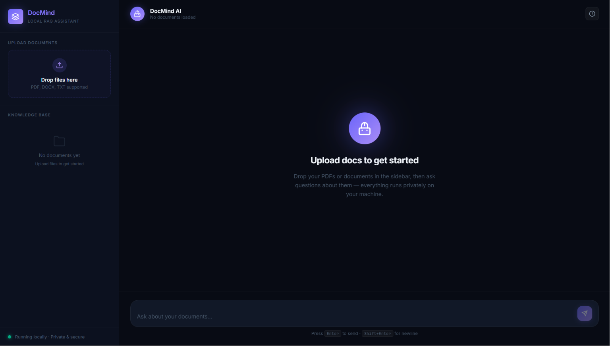
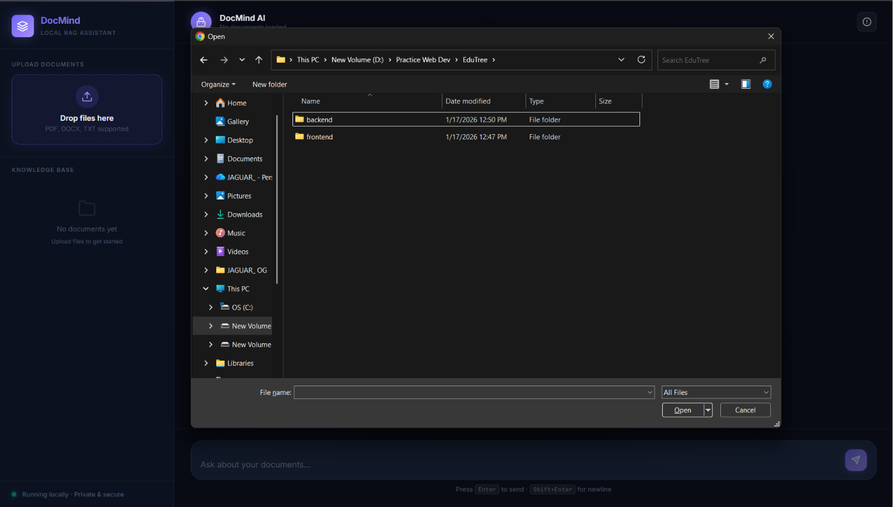
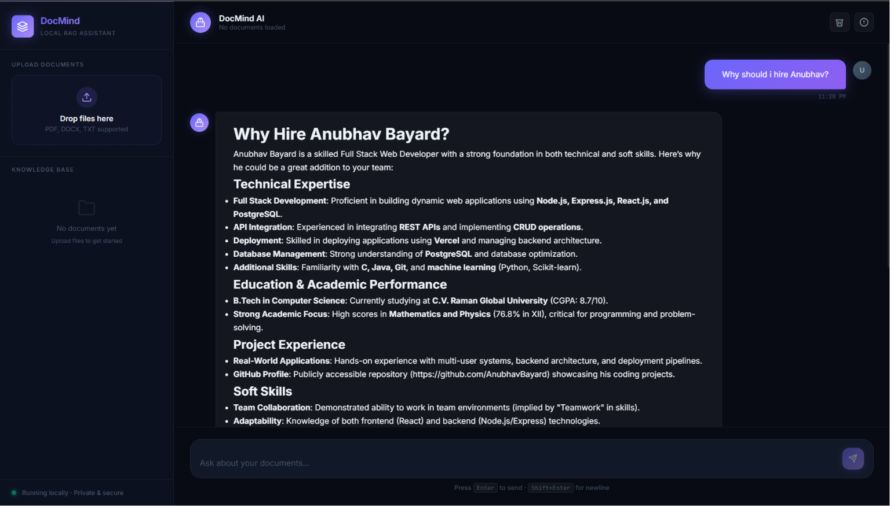

# My Manager – AI-Powered Personal Knowledge Assistant


---

## Demo

### 🎥 Demo Video

> Add your deployment/demo video here.

[Demo Video Link](YOUR_DEMO_VIDEO_LINK)

---

## Screenshots

<table>
<tr>
<td align="center">
<b>Chat Interface</b><br>

</td>

<td align="center">
<b>Upload Documents</b><br>

</td>
</tr>
</table>

---

## Retrieval Pipeline



---

## Overview

My Manager is a Retrieval-Augmented Generation (RAG) application that enables users to build a private AI-powered knowledge base from their own documents.

Users can upload documents, scanned PDFs, certificates, notes, reports, images, and other files, then ask natural language questions grounded in the uploaded content.

The system combines OCR, semantic search, query expansion, reranking, and LLM-powered answer generation to provide accurate, context-aware responses.

---

## Features

### 🔐 Authentication & Security

* Supabase Authentication
* Email & Password Login
* JWT Verification in FastAPI
* User-Specific Knowledge Bases
* Protected API Endpoints
* Secure Document Isolation

---

### 📄 Document Processing

Supported file types:

| Type | Supported |
| ---- | --------- |
| PDF  | ✅         |
| DOCX | ✅         |
| TXT  | ✅         |
| PNG  | ✅         |
| JPG  | ✅         |
| JPEG | ✅         |
| WEBP | ✅         |

Capabilities:

* PDF Text Extraction
* DOCX Parsing
* TXT Parsing
* Direct Image OCR
* OCR Fallback for Scanned PDFs
* Automatic Document Synchronization

---

### 🔍 OCR Pipeline

Powered by PaddleOCR.

Features:

* Scanned PDF Support
* Image Text Extraction
* Certificate Recognition
* Multi-Page OCR Processing

---

### 🧠 Retrieval Pipeline

#### Chunking

* Recursive Character Text Splitting
* Chunk Overlap Support
* Metadata Preservation

#### Embeddings

Embedding Model:

```text
BAAI/bge-base-en-v1.5
```

#### Vector Search

* ChromaDB Persistent Vector Store
* Semantic Similarity Search
* User-Specific Retrieval

#### Query Enhancement

* Query Rewriting
* Multi-Query Retrieval

Example:

```text
Original Query:
Do I have any certificates?

Generated Queries:
What certifications are available?
Any uploaded certificates?
Professional credentials in my documents?
Certification-related documents?
```

#### Re-Ranking

Cross Encoder:

```text
cross-encoder/ms-marco-MiniLM-L-6-v2
```

Features:

* Cross-Encoder Re-ranking
* Top-K Context Selection
* Improved Retrieval Accuracy

---

### 🤖 Answer Generation

Features:

* Retrieval-Augmented Generation (RAG)
* Context-Grounded Responses
* Markdown Formatting
* Source Attribution
* Hallucination Reduction

LLM Provider:

```text
Groq API
```

---

### 💻 Frontend

Built with:

* React
* Vite

Features:

* Modern Chat Interface
* Authentication Workflow
* File Upload System
* Source Attribution Display
* Responsive Design

---

### ⚙️ Backend

Built with:

* FastAPI
* Supabase
* ChromaDB
* Sentence Transformers

Features:

* REST API
* JWT Verification
* OCR Pipeline
* Vector Search
* Retrieval Orchestration
* User-Aware Document Retrieval

---

## Architecture

```text
User Login
        ↓
Document Upload
        ↓
Text Extraction
        ↓
OCR (if required)
        ↓
Chunking
        ↓
Embeddings
        ↓
ChromaDB
        ↓
Query Rewriting
        ↓
Multi-Query Retrieval
        ↓
Cross-Encoder Re-ranking
        ↓
Groq LLM
        ↓
Grounded Answer
```

---

## Tech Stack

### Frontend

* React
* Vite
* JavaScript

### Backend

* FastAPI
* Python
* ChromaDB
* Supabase Auth
* JWT Verification

### AI & NLP

* Sentence Transformers
* PaddleOCR
* Query Rewriting
* Multi-Query Retrieval
* Cross-Encoder Re-ranking

### Models

#### Embedding Model

```text
BAAI/bge-base-en-v1.5
```

#### Re-Ranking Model

```text
cross-encoder/ms-marco-MiniLM-L-6-v2
```

#### LLM

```text
Groq API
```

---

## API Endpoints

### Authentication

#### GET /me

Returns authenticated user information.

---

### Upload Documents

#### POST /upload

Uploads and indexes one or more documents into the user's private knowledge base.

---

### Search

#### GET /search

Returns the most relevant chunks for a query.

---

### Chat

#### GET /chat

Generates a grounded response using retrieved context.

---

## Installation

### Clone Repository

```bash
git clone https://github.com/AnubhavBayard/My-Manager.git

cd My-Manager
```

---

### Backend Setup

```bash
cd backend

python -m venv venv

venv\Scripts\activate

pip install -r requirements.txt
```

---

### Backend Environment Variables

Create a `.env` file inside the backend folder:

```env
SUPABASE_URL=YOUR_SUPABASE_URL
SUPABASE_KEY=YOUR_SUPABASE_KEY
GROQ_API_KEY=YOUR_GROQ_API_KEY
```

---

### Frontend Setup

```bash
cd local-rag-assistant

npm install

npm run dev
```

---

### Run Backend

```bash
cd backend

uvicorn main:app --reload
```

---

## Future Improvements

* Hybrid Search (BM25 + Vector Search)
* Chat History Persistence
* Supabase pgvector Migration
* Streaming Responses
* Citation Highlighting
* Parent Document Retrieval
* Docker Deployment
* Cloud Deployment
* Conversation Memory

---

## Author

### Anubhav Bayard

Built as a full-stack AI application combining:

* OCR
* Semantic Search
* Query Rewriting
* Multi-Query Retrieval
* Cross-Encoder Re-ranking
* Authentication
* Retrieval-Augmented Generation (RAG)

Designed as a private AI-powered personal knowledge assistant.
