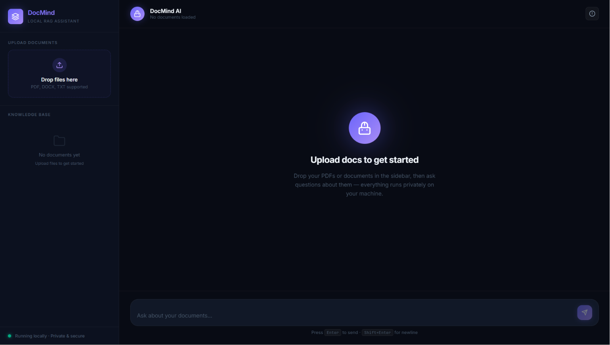
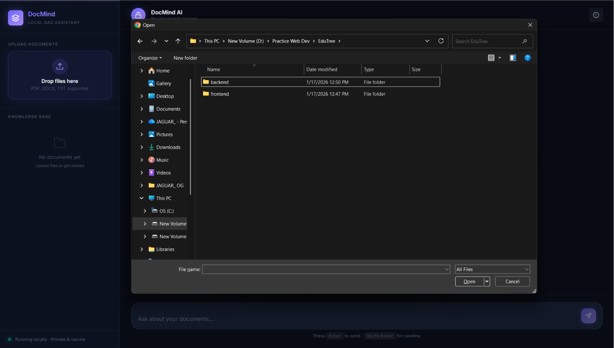
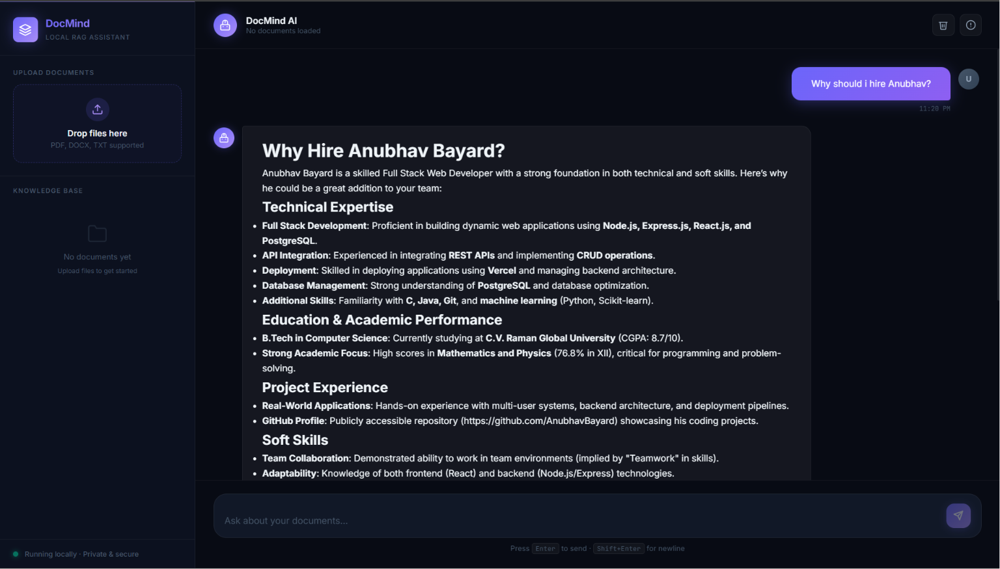

# 🤖 My Manager – AI-Powered Personal Knowledge Assistant

<div align="center">


<p align="center">
  <b>A private, enterprise-grade Retrieval-Augmented Generation (RAG) assistant for personal documents, certificates, scanned images, and notes.</b>
</p>

[Key Features](#-key-features) •
[Architecture](#-system-architecture) •
[Getting Started](#-getting-started-run-from-github) •
[API Reference](#-api-reference) •
[Docker Deployment](#-docker-deployment)

</div>

---

## 📸 Interface Preview

<div align="center">

<table>
  <tr>
    <td align="center" width="50%">
      <b>💬 AI Chat & Source Attribution</b><br><br>
      
    </td>
    <td align="center" width="50%">
      <b>📁 Multi-Format Document Ingestion</b><br><br>
      
    </td>
  </tr>
</table>

### 🔄 Multi-Stage Retrieval & RAG Pipeline



</div>

---

## 📌 Overview

**My Manager** is a full-stack, local-first Retrieval-Augmented Generation (RAG) system that converts your documents into an interactive, private AI knowledge base.

Upload PDFs, scanned certificates, text notes, DOCX files, and images—the pipeline extracts text via native parsers or OCR (PaddleOCR), generates high-density semantic vector embeddings, stores them in ChromaDB with user-level isolation, expands user queries using LLM-driven query rewriting, re-ranks contexts via a cross-encoder model, and synthesizes answers via Groq LLMs with source citations.

---

## ✨ Key Features

### 🔐 Multi-User Authentication & Security
* **Supabase Auth & JWT Middleware**: Secure user registration, sign-in, and token-based FastAPI route guards.
* **User-Isolated Storage**: Every document chunk in ChromaDB is tagged with the user's `user_id`, ensuring strict tenant isolation and zero data leak across accounts.

---

### 📄 Multi-Format Ingestion & Intelligent Parsing
* **Supported Formats**: `.pdf`, `.docx`, `.txt`, `.png`, `.jpg`, `.jpeg`, `.webp`.
* **PaddleOCR Integration**: Automatically processes scanned PDFs, certificates, receipts, and images when text extraction yields empty content.
* **Automatic Document Chunking**: Uses recursive character splitting with tuned overlap to preserve semantic context across chunk boundaries.

---

### 🧠 Advanced RAG Retrieval Pipeline
1. **Dense Vector Embeddings**: Utilizes state-of-the-art HuggingFace embeddings (`BAAI/bge-base-en-v1.5`).
2. **Query Expansion & Rewriting**: Uses LLM prompt engineering to rewrite incoming user queries into multiple semantic variations, drastically improving recall for complex or ambiguous queries.
3. **Multi-Query Vector Retrieval**: Queries ChromaDB across all query variations simultaneously.
4. **Cross-Encoder Re-Ranking**: Employs `cross-encoder/ms-marco-MiniLM-L-6-v2` to re-score and re-rank top vector hits, ensuring only highly relevant context reaches the LLM context window.

---

### 🤖 Grounded Answer Generation
* **Groq API Acceleration**: High-speed LLM inference powered by Groq (`openai/gpt-oss-20b` or custom Groq models).
* **Source Citation & Attribution**: Returns exact source filenames alongside generated answers, enabling transparent verification of information.
* **Hallucination Prevention**: Prompting strategies require answers to be strictly grounded in the retrieved document chunks.

---

### 💻 Modern Frontend Experience
* **React 18 + Vite**: Lightning-fast UI rendering with hot module replacement (HMR).
* **Clean UI Design**: Sleek dark/light styled components, source tags, real-time response generation feedback, and modal file uploaders.

---

## 🏗 System Architecture

```text
                        ┌────────────────────────┐
                        │      User Interface    │
                        │     (React + Vite)     │
                        └───────────┬────────────┘
                                    │ HTTP / JWT Auth
                                    ▼
┌─────────────────────────────────────────────────────────────────────────┐
│                           FastAPI Backend                               │
│                                                                         │
│  ┌──────────────────────┐        ┌───────────────────────────────────┐  │
│  │ Document Extractor   ├───────►│ Chunker & Embedding Pipeline     │  │
│  │ (PDF/DOCX/TXT/OCR)   │        │ (BAAI/bge-base-en-v1.5)           │  │
│  └──────────────────────┘        └─────────────────┬─────────────────┘  │
│                                                    │                    │
│                                                    ▼                    │
│                                   ┌───────────────────────────────────┐ │
│                                   │       ChromaDB Vector Store       │ │
│                                   │    (User Metadata Isolated)       │ │
│                                   └─────────────────┬─────────────────┘ │
│                                                     │                   │
│  ┌──────────────────────┐        ┌──────────────────┴────────────────┐  │
│  │   Query Rewriter     ├───────►│ Cross-Encoder Re-Ranker          │  │
│  │ (Multi-Query Expansion)      │ (ms-marco-MiniLM-L-6-v2)          │  │
│  └──────────────────────┘        └──────────────────┬────────────────┘  │
│                                                     │                   │
│                                                     ▼                   │
│                                  ┌────────────────────────────────────┐ │
│                                  │      Groq LLM Generation           │ │
│                                  └──────────────────┬─────────────────┘ │
└─────────────────────────────────────────────────────┼───────────────────┘
                                                      │ Grounded Response
                                                      ▼ + Citations
                                          ┌───────────────────────┐
                                          │      User Interface   │
                                          └───────────────────────┘
```

---

## 📁 Repository Structure

```text
My-Manager/
├── backend/                        # FastAPI Backend Application
│   ├── services/                   # Modular Pipeline Services
│   │   ├── auth.py                 # Supabase JWT Authentication Guard
│   │   ├── chunker.py              # Recursive Text Splitting Logic
│   │   ├── embedder.py             # BGE Embedding & ChromaDB Store Operations
│   │   ├── extractor.py            # Document Parsers (PDF, DOCX, TXT, OCR)
│   │   ├── generator.py            # Groq LLM Answer Synthesis & Prompting
│   │   ├── ocr.py                  # PaddleOCR Text Extraction Engine
│   │   ├── query_rewriter.py       # LLM Query Expansion Service
│   │   ├── reranker.py             # Cross-Encoder Context Re-ranking
│   │   └── retriever.py            # Vector & Pipeline Orchestrator
│   ├── chroma_db/                  # Local Chroma Vector Database Store
│   ├── uploads/                    # Uploaded Document Storage Directory
│   ├── config.py                   # Environment Configuration Loader
│   ├── main.py                     # FastAPI Application Routes & Middleware
│   ├── requirements.txt            # Python Dependencies
│   └── Dockerfile                  # Container build file for backend
├── local-rag-assistant/            # Frontend React Application
│   ├── src/                        # React Components, Hooks, API Services
│   ├── public/                     # Static Web Assets
│   ├── package.json                # Frontend Dependencies & Scripts
│   ├── vite.config.js              # Vite Build Configuration
│   └── Dockerfile                  # Container build file for frontend
├── screenshots/                    # UI & Architecture Showcase Images
│   ├── UI.png                      # Chat Interface Screenshot
│   ├── file-picker.png             # Upload Modal Screenshot
│   └── working.png                 # System Diagram
├── docker-compose.yml              # Multi-container Orchestration File
├── README.md                       # Main Project Documentation (New)
└── README_OLD.md                   # Preserved Legacy Documentation Reference
```

---

## 🚀 Getting Started (Run from GitHub)

Follow these step-by-step instructions to clone, configure, and launch the project on your local machine.

### 📋 Prerequisites

Ensure you have the following installed on your system:
* **Git**: [Install Git](https://git-scm.com/)
* **Python**: `3.11` or higher ([Download Python](https://www.python.org/))
* **Node.js**: `18.0.0` or higher & `npm` ([Download Node.js](https://nodejs.org/))
* **Supabase Account**: Free project setup at [Supabase](https://supabase.com/)
* **Groq API Key**: Free API key at [Groq Console](https://console.groq.com/)
* *(Optional)* **Docker & Docker Compose**: [Install Docker Desktop](https://www.docker.com/)

---

### 1️⃣ Clone the Repository

Open your terminal and run:

```bash
git clone https://github.com/AnubhavBayard/My-Manager.git
cd My-Manager
```

---

### 2️⃣ Option A: Quick Start with Docker Compose (Recommended)

Run the full stack with isolated containers in a single command.

#### Step 1: Create Environment Files
Copy the `.env.example` templates in both services to `.env`:

```bash
# Backend configuration
cp backend/.env.example backend/.env

# Frontend configuration
cp local-rag-assistant/.env.example local-rag-assistant/.env
```

Edit `backend/.env` with your Supabase credentials (`SUPABASE_URL`, `SUPABASE_KEY`) and Groq API key (`GROQ_API_KEY`).
Edit `local-rag-assistant/.env` with your Supabase frontend credentials (`VITE_SUPABASE_URL`, `VITE_SUPABASE_ANON_KEY`).

#### Step 2: Build and Run Containers

From the project root directory, run:

```bash
docker-compose up --build
```

#### Step 3: Access the Application
* **Frontend App**: `http://localhost:3000`
* **Backend API**: `http://localhost:8000` (API documentation at `http://localhost:8000/docs`)

---

### 3️⃣ Option B: Local Development Setup (Manual)

If you prefer to run services manually without Docker:

#### Step 1: Backend Setup
```bash
cd backend
cp .env.example .env # edit with your keys
pip install -r requirements.txt
uvicorn main:app --reload --host 127.0.0.1 --port 8000
```

#### Step 2: Frontend Setup
```bash
cd local-rag-assistant
cp .env.example .env # edit with your keys
npm install
npm run dev
```

---

## 🔌 API Reference

### Authentication Guard

All protected routes accept a `Authorization: Bearer <SUPABASE_JWT_TOKEN>` header.

| Endpoint | Method | Description | Auth Required |
| :--- | :--- | :--- | :--- |
| `/me` | `GET` | Validates JWT token and returns authenticated user profile | Yes |
| `/upload` | `POST` | Ingests multi-file payloads (PDF, DOCX, TXT, Images), runs OCR/Chunking/Embedding, and stores chunks | Yes |
| `/search` | `GET` | Performs vector search with query rewriting and cross-encoder re-ranking; returns raw chunks | Yes |
| `/chat` | `GET` | Executes full RAG pipeline, generating grounded response with source citations | Yes |

---

## 🛠 Tech Stack Summary

| Layer | Technologies |
| :--- | :--- |
| **Frontend Framework** | React 18, Vite, JavaScript (ES6+), HTML5, CSS3 |
| **Backend Framework** | Python 3.11+, FastAPI, Uvicorn, Pydantic |
| **Authentication** | Supabase Auth, PyJWT, Security Bearer Tokens |
| **Document Parsers** | PyPDF2, python-docx, PaddleOCR, Pillow |
| **Vector Database** | ChromaDB (Persistent Disk Store) |
| **Embedding Model** | `BAAI/bge-base-en-v1.5` via `sentence-transformers` |
| **Re-Ranker Model** | `cross-encoder/ms-marco-MiniLM-L-6-v2` |
| **LLM Engine** | Groq API (`openai/gpt-oss-20b`) |
| **Containerization** | Docker, Docker Compose, Nginx |

---

## 🔮 Future Enhancements & Roadmap

- [ ] **Hybrid Search Integration**: Combine BM25 keyword matching with dense vector retrieval.
- [ ] **Persistent Chat History**: Store conversation memory in Supabase PostgreSQL database.
- [ ] **Streaming LLM Responses**: Implement Server-Sent Events (SSE) or WebSockets for real-time text streaming.
- [ ] **PDF Preview with Citation Highlighting**: Deep-link source citations directly to highlighted PDF pages.
- [ ] **Supabase pgvector Migration**: Cloud vector database support for large scale production deployments.

---

## 📜 Preserved Original README

If you wish to view the original repository README file for historical context or comparison, it has been preserved in [README_OLD.md](file:///media/beast/New%20Volume/My%20Manager/README_OLD.md).

---

## 👤 Author & Acknowledgments

**Anubhav Bayard**  
- GitHub: [@AnubhavBayard](https://github.com/AnubhavBayard)

*Built with passion as an advanced open-source AI knowledge assistant.*
